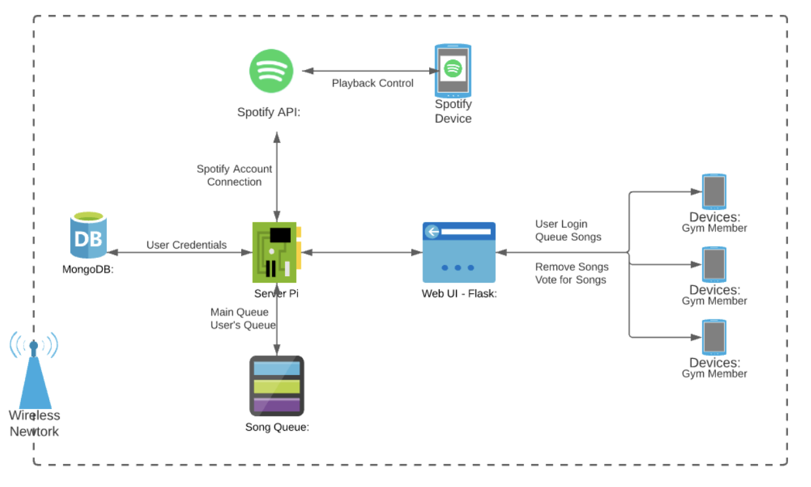

# GYMIFY

## Gym Spotify Collaborative  Listening Room

---

### This is my take on a Spotify collaborative listening room using Flask and Spotify API.

### Featuring a vote system where users can add, remove and vote for songs on a Spotify queue

---

## System Diagram

---

## Concept of Operation

Imagine you are heading over to the gym to work out. What would you bring with you? Surely you would bring a towel, a water bottle, and perhaps a snack to enjoy. In addition, you would certainly bring your headphones to listen to music as you work out. However, consider the scenario in which you forgot to bring your headphones. In this case, you would be subjected to the gym's music selection which is not always appealing. This system, a song music queue, proposes a solution to this problem. By using this queue, gym members will be able to add songs, allowing them to listen to the music they wish to hear over the speakers. This will promote socialization among members as they will no longer be wearing headphones.

This system will contain a Raspberry Pi which acts as the overall server. Gym members will be able to log into the system using their device with credentials provided by the gym. Upon a successful log in, the members will be shown the current song, as well as the songs contained in the queue. Using Spotify, they will be able to search for a song and add up to three to the queue. They will also have the opportunity to vote for a song already in the queue as well as remove their songs.
